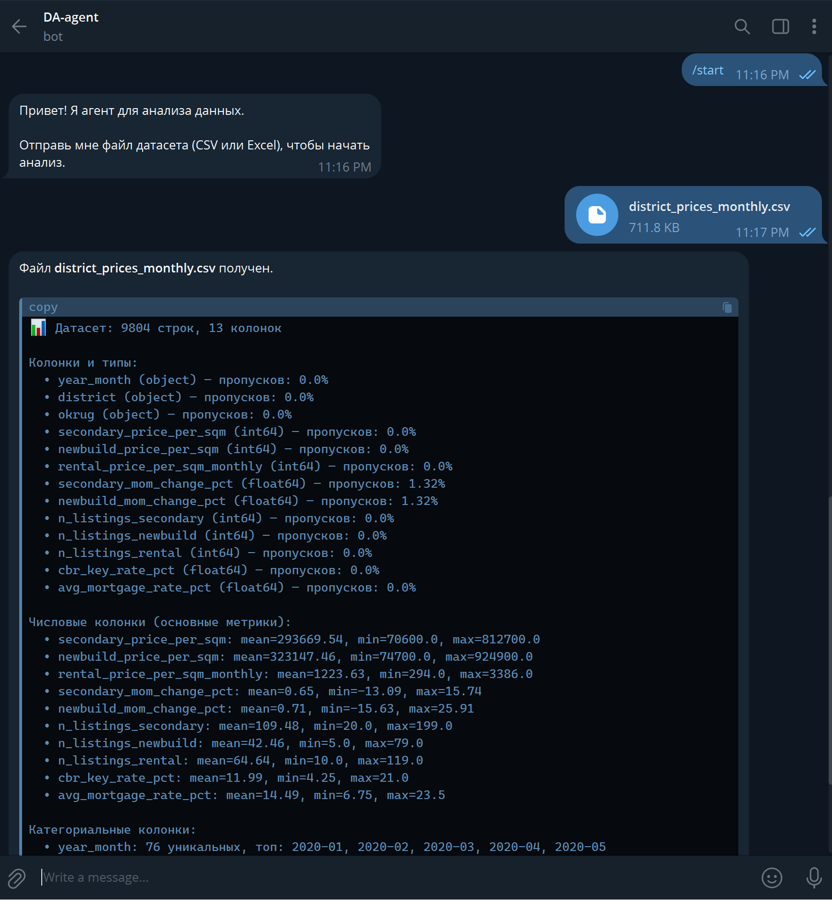
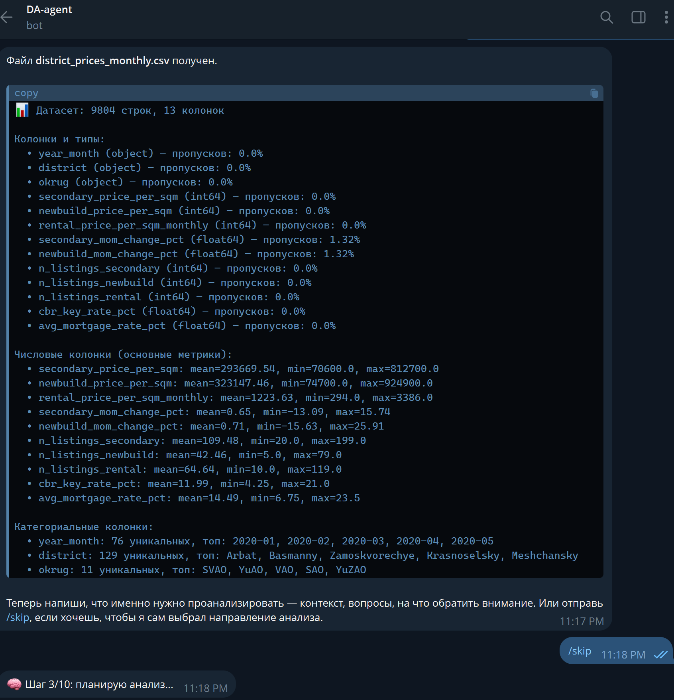

# Data Agent Bot

Telegram-бот для автономного анализа данных с помощью LLM-агента. Бот принимает датасеты (CSV/Excel), а LLM сама проводит аналитику через выполнение кода в изолированном Docker-контейнере.

## Возможности

- Загрузка датасетов CSV и Excel
- Автоматический профайлинг данных
- Агентный анализ через LLM (ReAct + tool calling)
- Безопасное выполнение кода в Docker-sandbox
- Генерация графиков и визуализаций
- Защита от prompt injection

## Архитектура

```
Пользователь (Telegram)
    ↓
aiogram 3 Bot
    ↓
ReAct Agent (LLMClient)
    ↓
Docker Sandbox ← pandas, matplotlib, seaborn
```

## Требования

- Python 3.11+
- Docker (для sandbox)
- Telegram Bot Token
- API ключ любого OpenAI-compatible провайдера

## Установка

```bash
# Клонировать репозиторий
cd data-agent-bot

# Установить зависимости
pip install aiogram openai redis pydantic pydantic-settings pandas numpy matplotlib seaborn openpyxl python-dotenv

# Или через Poetry
poetry install
```

## Настройка

Создать файл `.env` (скопировать из `.env.example`):

```env
BOT_TOKEN=your_telegram_bot_token
LLM_API_KEY=your_canopywave_api_key
LLM_BASE_URL=https://inference.canopywave.io/v1
LLM_MODEL=moonshot/kimi-k2.6
```

## Запуск

```bash
# Собрать Docker-образ sandbox
docker build -t data-agent-sandbox ./sandbox

# Запустить бота
python run.py
```

## Docker Compose

```bash
docker-compose up --build
```

## Использование

1. Отправить боту файл CSV или Excel
2. Указать контекст анализа (или отправить `/skip`)
3. Дождаться завершения анализа
4. Получить отчёт и графики

## Структура проекта

```
data-agent-bot/
├── src/
│   ├── main.py              # Точка входа
│   ├── config.py            # Конфигурация
│   ├── bot/
│   │   ├── handlers.py      # Хэндлеры Telegram
│   │   └── states.py        # FSM состояния
│   ├── agent/
│   │   ├── llm_client.py    # OpenAI-compatible клиент
│   │   ├── react_loop.py    # ReAct цикл агента
│   │   ├── executor.py      # Docker sandbox
│   │   ├── tools.py         # Определения инструментов
│   │   ├── prompts.py       # Системные промпты
│   │   └── guardrails.py    # Защита от injection
│   └── utils/
│       ├── dataset_io.py    # Загрузка датасетов
│       └── temp_manager.py  # Управление временными файлами
├── sandbox/                 # Dockerfile для sandbox
├── docker-compose.yml
├── pyproject.toml
└── .env.example
```
## Скриншоты работы 





